# **🛠️ BuggyBuddy Model Builder [Microservice]**

## Overview

BuggyBuddy Model Builder is a component of the [BuggyBuddy](https://github.com/rezadzikri19/BuggyBuddy) project, serving as a **Model Builder (Create, Train, Evaluate, Save)**. This Model Builder is designed to automatically train new models when new data is available, ensuring that the model remains relevant.

## Features

1. **Complete Model Builder Pipeline**:
   - Create, Train, Evaluate, and Export model.
2. **Flexible Implementation**:
   - Provides the flexibility to seamlessly switch between different drivers or implementations, ensuring adaptability to changing technology stack requirements.
3. **Integration with RabbitMQ**:
   - Seamlessly communicates with other microservices via RabbitMQ, facilitating efficient integration and communication within the ecosystem.

## Pipelines

The pipeline begins with the process of extracting data from an AWS S3 Bucket in the pandas.parquet format. The extracted data then enters the preprocessing pipeline, starting from dropping unused features to creating report pairs and labels.

The processed data is then used to train a model, which is evaluated for performance using several metrics (`precision`, `recall`, and `f1`). Models that meet the criteria are stored in an AWS S3 Bucket and can be used by other microservices.

```mermaid
flowchart LR;
    fetch_data["`**Extract Data**:
    AWS S3 Bucket`"]
    style fetch_data text-align:center

    preprocessing["`**Preprocessing**:
    • drop unused features
    • remove duplicates
    • aggregate text features
    • clean sentences
    • remove stopwords
    • sentence embedding (all-MiniLM-L6-v2)
    • reports pairing & labeling`"]
    style preprocessing text-align:center

    model_training["`**Model Training**:
    • build model
    • train model`"]
    style model_training text-align:center

    model_evaluation["`**Model Evaluation**:
    • precision score
    • recall score
    • f1 score`"]
    style model_evaluation text-align:center

    model_saving["`**Model Saving**:
    AWS S3 Bucket`"]
    style model_saving text-align:center

    fetch_data --> preprocessing
    preprocessing --> model_training
    model_training --> model_evaluation
    model_evaluation --> model_saving
```



For more detailed information, you can check the [BuggyBuddy Notebook Repository](https://github.com/rezadzikri19/BuggyBuddy-Notebook).

## Folder Structure

```
app/
├── src/
│   └── core/
│       ├── dtos/                 <- DTOs for transferring data between pipelines/modules.
│       ├── entities/             <- Domain entities representing data objects.
│       ├── ports/                <- Ports defining contracts for drivers.
│       ├── usecases/             <- Use cases implementing business logic.
│       └── utils/                <- Utility functions and helpers.
└── infrastructure/
    ├── data/                     <- Data related drivers (data extractor, preprocessor, loader)
    ├── model/                    <- Model related drivers (model creator, trainer, evaluator, and saver)
    ├── loggers/                  <- Logging utilities drivers.
    ├── message/                  <- Message broker drivers (RabbitMQ).
    └── utils/                    <- Additional utilities and helpers for infrastructure-related tasks.
```

## Tech Stack

- **Programming Language**: Python
- **ETL Framework**: Pandas, Numpy, ScikitLearn
- **Data Wharehouse**: AWS S3 Bucket
- **Messaging**: RabbitMQ

## Installation

**1. Clone the repository:**

```bash
git clone <repository-url>
cd <repository-directory>
```

**2. Install & initialization:**

```bash
./entry_point.sh
```

**3. Configure the application environment:**

```bash
cp .env.example .env
```

> Edit the `.env` file and configure the necessary settings for your environment.

## Usage

Edit the `.env` file and configure the necessary settings for your environment.

**_Running app_**:

```bash
./run.sh
```

**_Trigger training pipeline_**:
This microservice utilizes RabbitMQ events published by the [BuggyBuddy ETL microservice](https://github.com/rezadzikri19/BuggyBuddy-ETL-Microservice) to notify when new data is available, triggering the training pipeline. Below are the *exchange*, *route*, and *data* of the subscribed message:

```bash
    exchange: 'etl_service',
    routing_key: 'all_pipeline',
    data: {
      'status': 'SUCCESS',
      'message': <any_message>
    }
```

> Make sure that `RabbitMQ` is installed and running on your machine before starting the app.

## Publised Event Messaging

The following types of events/messages are published by the BuggyBuddy Model Builder Microservice:

1. **Train_Pipeline_Data**: Published when data pipeline successfully executed (data extraction, preprocessing, and loading/caching). Below are *exchange*, *route*, and *data* of the message:

```bash
    exchange: 'train_service',
    routing_key: 'data_pipeline',
    data: {
      'status': 'SUCCESS' | 'FAILED',
      'message': 'MODEL_PIPELINE [DATA] - SUCCESS' | <error_message>
    }
```

2. **Train_Pipeline_Transform**: Published when model pipeline successfully executed (model creation, training, evaluation, and saving). Below are *exchange*, *route*, and *data* of the message:

```bash
    exchange: 'train_service',
    routing_key: 'model_pipeline',
    data: {
      'status': 'SUCCESS' | 'FAILED',
      'message': 'MODEL_PIPELINE [MODEL] - SUCCESS' | <error_message>
    }
```

3. **Train_Pipeline_All**: Published when all pipeline are successfully executed (data and model pipeline). Below are *exchange*, *route*, and *data* of the message:

```bash
    exchange: 'train_service',
    routing_key: 'all_pipeline',
    data: {
      'status': 'SUCCESS' | 'FAILED',
      'message': 'MODEL_PIPELINE [ALL] - SUCCESS' | <error_message>
    }
```

## License

This microservice is licensed under the [MIT License](LICENSE). You are free to use, modify, and distribute this software for any purpose, with or without attribution.
