# **Model Builder Microservice [BuggyBuddy🐞]**

## Overview

This microservice is a component of the [BuggyBuddy](http://example.com) project, serving as a **Model Builder (Create, Train, Evaluate)**. The resulting model is capable of detecting whether two reports are unique or duplicated. The model is trained using sentence pairs with a label of 0 for different reports and 1 for duplicated reports. Overall, the model exhibits satisfactory performance with an average AUC score of 89% (trained using [FIrefox Bug Report Dataset]()).

## Features

1. **Complete Model Builder Pipeline**:
   - Create, Train, and Evaluate model.
2. **Flexible Implementation**:
   - Provides the flexibility to seamlessly switch between different drivers or implementations, ensuring adaptability to changing technology stack requirements.
3. **Integration with RabbitMQ**:
   - Seamlessly communicates with other microservices via RabbitMQ, facilitating efficient integration and communication within the ecosystem.

## Pipelines

**1. Data Pipeline:**

```mermaid
flowchart LR;
    fetch_data["`**Extract Data**:
    AWS S3 Bucket`"]
    style fetch_data text-align:center

    preprocessing["`**Preprocessing**:
    • drop unused features
    • remove duplicates
    • aggregate text features
    • clean sentences
    • remove stopwords
    • sentence embedding (all-MiniLM-L6-v2)
    • reports pairing & labeling`"]
    style preprocessing text-align:center

    report{{"`**Raw Reports**
    - status
    - product
    - component
    - description
    - resolution
    - severity
    - etc..*`"}}
    style report text-align:center

    report_1{{"`**Preprocessed Reports**
    *- embedded_text_left (384 vectors)
    - embedded_text_right (384 vectors)
    - label (0 for unique, 1 for duplicated)*`"}}
    style report_1 text-align:center

    fetch_data --> report
    report --> preprocessing
    preprocessing --> report_1
```



**2. Training Model Pipeline:**

```mermaid
flowchart LR;
    report_l{{"`**embedded_text_left**
    384 vectors`"}}
    style report_l text-align:center

    report_r{{"`**embedded_text_right**
    384 vectors`"}}
    style report_r text-align:center

    input_layer["`**Dense_Layer**
    128 nodes (linear)
    ⬤
    ⬤
    ⬤
    .
    .
    .
    ⬤
    ⬤
    ⬤`"]
    style input_layer text-align:center

    similar["`**Normalized_Dot_Layer**
    cosine_similarity
    ⬤`"]
    style similar text-align:center

    output_layer["`**Dense_Layer**
    1 node (sigmoid)
    ⬤`"]
    style output_layer text-align:center

    result{{"`**similarity score**
    1 - 0`"}}
    style result text-align:center

    report_l --> input_layer
    report_r --> input_layer

    input_layer --> similar
    similar --> output_layer
    output_layer --> result
```



**3. Inference/Embedding Model Pipeline:**

```mermaid
flowchart LR;
    report_l{{"`**embedded_text_1**
    384 vectors`"}}
    style report_l text-align:center

    report_r{{"`**embedded_text_2**
    384 vectors`"}}
    style report_r text-align:center

    input_layer["`**Dense_Layer**
    128 nodes (linear)
    ⬤
    ⬤
    ⬤
    .
    .
    .
    ⬤
    ⬤
    ⬤`"]
    style input_layer text-align:center

    similar["`**Similarity Score**
    cosine_similarity`"]
    style similar text-align:center

    output_layer["`**Threshold**
    if score > threshold: duplicated
    else: not duplicated`"]
    style output_layer text-align:center

    result{{"`**Is Duplicated?**
    1 | 0`"}}
    style result text-align:center

    report_l --> input_layer
    report_r --> input_layer

    input_layer --> similar
    similar --> output_layer
    output_layer --> result
```



## Folder Structure

```
my_project/
│
├── src/
│   └── core/                     <- Core functionality of the microservice.
│       ├── dtos/                 <- Data Transfer Objects (DTOs) for transferring data between modules (data & model).
│       ├── entities/             <- Domain entities representing data objects (data & model).
│       ├── ports/                <- Ports defining contracts for external services/drivers (data & model).
│       ├── usecases/             <- Use cases implementing business logic and orchestrating interactions (data & model).
│       └── utils/                <- Utility functions and helpers (data & model).
│
└── infrastructure/               <- Infrastructure-related code and implementations that adhere to the port contract.
    ├── data/                     <- Data extractor, preprocessor, loader drivers
    ├── model/                    <- Model creator, trainer, evaluator, and saver drivers
    ├── loggers/                  <- Logging utilities for capturing application logs.
    ├── message/                  <- Message brokers and communication interfaces (RabbitMQ driver).
    └── utils/                    <- Additional utilities and helpers for infrastructure-related tasks.
```

## Tech Stack

- **Programming Language**: Python
- **ETL Framework**: pandas, numpy, sklearn
- **Data Wharehouse**: AWS S3 Bucket
- **Messaging**: RabbitMQ

## Installation

**1. Clone the repository:**

```bash
git clone <repository-url>
cd <repository-directory>
```

**2. Install & initialization:**

```bash
./entry_point.sh
```

**3. Configure the application environment:**

```bash
cp .env.example .env
```

> Edit the `.env` file and configure the necessary settings for your environment.

## Usage

Edit the `.env` file and configure the necessary settings for your environment.

**_Running app_**:

```bash
./run.sh
```

**_Scheduled cron job (default monthly)_**:
This microservice uses RabbitMQ event publised by the ETL microservice to inform new data is available. Below are *exchange*, *route*, and *data* of the trigger message:

```bash
    exchange: 'etl_service',
    routing_key: 'all_pipeline',
    data: {
      'status': 'SUCCESS',
      'message': <any_message>
    }
```

> Make sure that `RabbitMQ` is installed and running on your machine before starting the app.

## Publised Event Messaging

The following types of events/messages are published by the BuggyBuddy ETL Pipeline Microservice:

1. **Train_Pipeline_Data**: Published when data pipeline successfully executed (data extraction, preprocessing, and loading/caching). Below are *exchange*, *route*, and *data* of the message:

```bash
    exchange: 'train_service',
    routing_key: 'data_pipeline',
    data: {
      'status': 'SUCCESS' | 'FAILED',
      'message': 'MODEL_PIPELINE [DATA] - SUCCESS' | <error_message>
    }
```

2. **Train_Pipeline_Transform**: Published when model pipeline successfully executed (model creation, training, evaluation, and saving). Below are *exchange*, *route*, and *data* of the message:

```bash
    exchange: 'train_service',
    routing_key: 'model_pipeline',
    data: {
      'status': 'SUCCESS' | 'FAILED',
      'message': 'MODEL_PIPELINE [MODEL] - SUCCESS' | <error_message>
    }
```

3. **Train_Pipeline_All**: Published when all pipeline are successfully executed (data and model pipeline). Below are *exchange*, *route*, and *data* of the message:

```bash
    exchange: 'train_service',
    routing_key: 'all_pipeline',
    data: {
      'status': 'SUCCESS' | 'FAILED',
      'message': 'MODEL_PIPELINE [ALL] - SUCCESS' | <error_message>
    }
```

## License

This microservice is licensed under the [MIT License](LICENSE). You are free to use, modify, and distribute this software for any purpose, with or without attribution.
